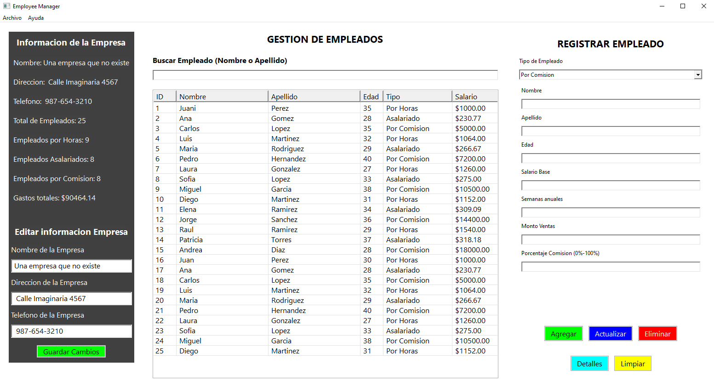
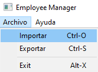
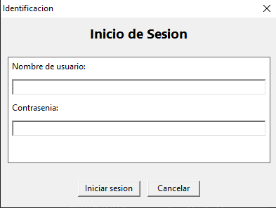

# Employee Manager

**Employee Manager** es una aplicación de escritorio para la gestión de empleados, desarrollada en **C++** siguiendo el paradigma de **orientación a objetos**. Cuenta con una interfaz gráfica creada con la biblioteca **wxWidgets**.

## Características del Sistema

### Gestión de Empleados

- **Agregar empleados**: Registra empleados de diferentes tipos (por horas, asalariados, por comisión) mediante un formulario.
- **Editar empleados**: Actualiza la información de un empleado seleccionado.
- **Eliminar empleados**: Elimina empleados seleccionados de la lista.
- **Visualizar detalles**: Muestra información completa de un empleado en un cuadro de diálogo.
- **Buscar empleados**: Encuentra empleados por nombre o apellido con una barra de búsqueda.

### Gestión de la Empresa

- **Ver información**: Muestra un resumen con los datos de la empresa.

- **Actualizar información**: Permite modificar datos de la empresa como nombre, dirección y teléfono.

### Estadísticas

- **Total de empleados**: Visualiza el número total de empleados registrados.
- **Empleados por tipo**: Muestra la cantidad de empleados clasificados por tipo (por horas, asalariados, por comisión).
- **Gastos totales**: Calcula y presenta el costo total de los salarios.

### Almacenamiento y Manejo de Datos

- **Persistencia**: Los datos de los empleados se almacenan y recuperan de un archivo de texto (`empresa.txt`) ubicado en el directorio `data`.
- **Importación y exportación**: Permite la carga y descarga de datos mediante archivos de texto.

## Arquitectura Técnica

### Diseño Orientado a Objetos

- **Clases Abstractas**: La clase `Empleado` sirve como base abstracta y define métodos virtuales puros (`CalcularSalario`, `GetInfo`) que son implementados en las clases derivadas.

- **Encapsulamiento**: Los atributos de las clases están protegidos y solo se puede acceder a ellos mediante métodos públicos (getters y setters), lo que asegura la integridad de los datos.

- **Herencia**:

  - `EmpleadoAsalariado` extiende `Empleado`.
  - `EmpleadoPorComision` extiende `EmpleadoAsalariado`.
  - `EmpleadoPorHoras` extiende `Empleado`.

- **Polimorfismo**: Utiliza punteros a la clase base `Empleado` para manejar diferentes tipos de empleados de manera uniforme.

### Interfaz Gráfica

- Construida con **wxWidgets**.
- La clase `MainFrame` centraliza las interacciones del usuario.

## Configuración del Entorno

### Requisitos

- **wxWidgets**: Versión 3.2.6.
- **Compilador**: MinGW (Windows) o cualquier compilador compatible con C++ en Linux.

### Configuración para Visual Studio Code

Incluye configuraciones en el directorio `.vscode` para simplificar la configuración del entorno:

- `c_cpp_properties.json`: Configura rutas de inclusión y el compilador.
- `settings.json`: Define asociaciones de archivos.
- `tasks.json`: Contiene tareas preconfiguradas para compilar y ejecutar el proyecto.

### Compilación

#### Windows

1. Abre Visual Studio Code.
2. Ejecuta la tarea de compilación (`tasks.json`) con `Ctrl+Shift+P`.
3. Ejecuta el binario generado (`./EmployeeManager`).

#### Linux

1. Ejecuta el script `build.bash` incluido en el proyecto para compilar y ejecutar.

## Guía de Uso

1. Ejecuta la aplicación.
2. Inicia sesión con las credenciales predeterminadas almacenadas en `data/credenciales.bin`:
   - **Usuario**: admin
   - **Contraseña**: 1234

3. Usa las funcionalidades del sistema para gestionar empleados y la información de la empresa.

## Autor

Desarrollado por [**FrankSkep**](https://github.com/FrankSkep/employee-manager).
